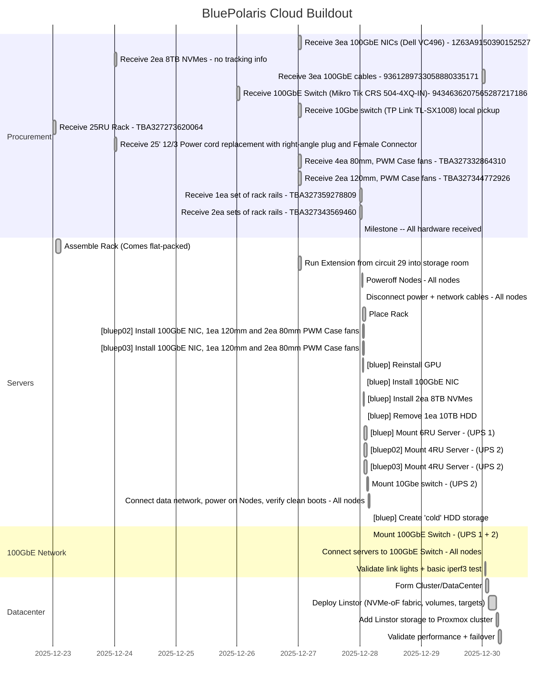

```mermaid
gantt
     dateFormat YYYY-MM-DD
     title BluePolaris Cloud Buildout

section Procurement
Receive 3ea 100GbE NICs (Dell VC496) - 1Z63A9150390152527 :done, task01, 2025-12-27, 1h
Receive 2ea 8TB NVMes - no tracking info :done, task02, 2025-12-24, 1h
Receive 3ea 100GbE cables - 9361289733058880335171 :done, task03, 2025-12-30, 1h
Receive 100GbE Switch (Mikro Tik CRS 504-4XQ-IN)- 9434636207565287217186 :done, task04, 2025-12-26, 1h
Receive 10Gbe switch (TP Link TL-SX1008) local pickup :done,  task05, 2025-12-27, 1h
Receive 25RU Rack - TBA327273620064 :done, task06, 2025-12-23, 1h
Receive 25' 12/3 Power cord replacement with right-angle plug and Female Connector :done, task07, 2025-12-24, 1h
Receive 4ea 80mm, PWM Case fans - TBA327332864310 :done, task07a, 2025-12-27, 1h
Receive 2ea 120mm, PWM Case fans - TBA327344772926 :done, task07b, 2025-12-27, 1h
Receive 1ea set of rack rails - TBA327359278809 :done, task07c, 2025-12-28, 1h
Receive 2ea sets of rack rails - TBA327343569460 :done, task07d, 2025-12-28, 1h
Milestone -- All hardware received :done, task08, after task01 task02 task03 task04 task05 task06 task07 task07a task07b task07c task07d, 0.1h

section Servers
Assemble Rack (Comes flat-packed) :done, task09, after task06, 2h
Run Extension from circuit 29 into storage room :done, task10, 2025-12-27, 1h
Poweroff Nodes - All nodes :done, task13, after task01 task02 task05 task07a task07b task07c task07d task09 task10, 0.15h
Disconnect power + network cables - All nodes :done, task14, after task13, 0.1h
Place Rack :done, task11, after task14, 1h
[bluep02] Install 100GbE NIC, 1ea 120mm and 2ea 80mm PWM Case fans :done, task15, after task01 task07b task07a task14, 0.5h
[bluep03] Install 100GbE NIC, 1ea 120mm and 2ea 80mm PWM Case fans :done, task16, after task01 task07b task07a task14, 0.5h
[bluep] Reinstall GPU :done, task17, after task01 task02 task14, 0.1h
[bluep] Install 100GbE NIC :done, task18, after task17, 0.1h
[bluep] Install 2ea 8TB NVMes :done, task19, after task17, 0.25h
[bluep] Remove 1ea 10TB HDD :done, task20, after task18 task19, 0.25h
[bluep] Mount 6RU Server - (UPS 1) :done, task21, after task14 task20, 1h
[bluep02] Mount 4RU Server - (UPS 2) :done, task22, after task14 task15, 1h
[bluep03] Mount 4RU Server - (UPS 2) :done, task23, after task14 task16, 1h
Mount 10Gbe switch - (UPS 2) :done, task29, after task05 task21 task22 task23, 0.5h
Connect data network, power on Nodes, verify clean boots - All nodes :done, task26, after task29, 0.5h
[bluep] Create 'cold' HDD storage :done, task28, after task26, 0.1h

section 100GbE Network
Mount 100GbE Switch - (UPS 1 + 2) :done, task24, after task04 task26, 0.15h
Connect servers to 100GbE Switch - All nodes :done, task25, after task03 task24, 0.15h
Validate link lights + basic iperf3 test :done, task27, after task25, 0.25h

section Datacenter
Form Cluster/DataCenter :done, task35, after task27 task28, 1h
Deploy Linstor (NVMe-oF fabric, volumes, targets) :done, task36, after task35, 3h
Add Linstor storage to Proxmox cluster :done, task37, after task36, 1h
Validate performance + failover :done, task38, after task37, 1h

```