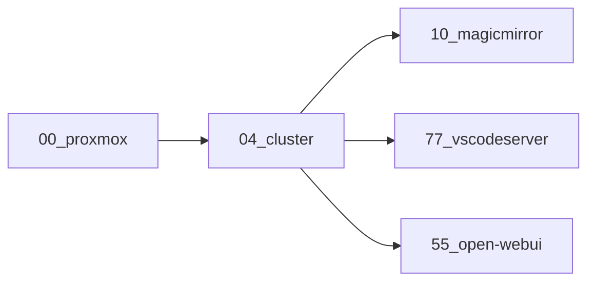

# 📜 Ansible Playbooks Overview

This directory contains the orchestration logic for provisioning and configuring the homelab infrastructure. Each playbook is scoped to a specific phase of the system lifecycle — from VM creation and container setup to cluster deployment and service initialization.

For example, to provision, configure, deploy and support development my 'production' environment

Variable files (`*.yaml`) are used to inject structured configuration into playbooks, keeping logic declarative and reusable.

---

## 📦 Playbook Index

| Playbook | Description |
|----------|-------------|
| `00_proxmox.yaml` | Provisions Proxmox VMs and containers, sets up Vault with TLS and auto-unseal. |
| `01_template_overrides.yaml` | Variable file for customizing VM templates. |
| `03_sha_keys.yaml` | Variable file containing SSH keys used for provisioning. |
| `04_cluster.yaml` | Builds a MicroK8s cluster with MicroCeph, configures Vault, and deploys microservices. |
| `05_disk_list.yaml` | Variable file defining disk layout for MicroCeph nodes. |
| `10_magicmirror.yaml` | Provisions a container and installs MagicMirror² with Node.js and PM2. |
| `55_open-webui.yaml` | Sets up an LXC container with GPU passthrough to run Open WebUI and Ollama. |
| `77_vscodeserver.yaml` | Provisions a container and installs VS Code Server dependencies, CLI tools, and Git config. |
| `88_proxmox_provision.yaml` | Draft playbook for unified Proxmox provisioning based on inventory `type=kvm` or `type=lxc`. |
| `manifest-sync-test.yaml` | Example of using `kubernetes-manifests-sync` with or without specifying `sync_keys` |
| `wait_for_hosts.yaml` | Utility playbook to pause execution until hosts are reachable post-reboot. |

---

## 🧭 Usage Notes

- Playbooks are designed to be run sequentially or selectively using tags.
- Variable files (`01`, `03`, `05`) are intended to be included via `vars_files` in other playbooks.
- Inventory metadata (e.g. `type=kvm`, `type=lxc`) is used to drive conditional logic in advanced provisioning.
- Most playbooks assume root or elevated privileges on target hosts.

---

## 🧪 Future Enhancements

- Refactor `88_proxmox_provision.yaml` into a meta-role or collection for unified VM/container provisioning.
- Add tags to playbooks for selective execution (e.g. `--tags vault`, `--tags cluster`).
- Introduce playbook dependencies or orchestration via a master playbook or Makefile.
- Visualize playbook flow using Mermaid diagrams.

---

## 🤝 Contributions

This repository is a living system. If you spot improvements, edge cases, or want to extend functionality — PRs and issues are welcome.
